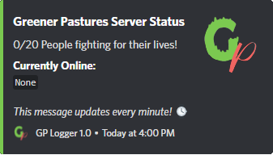

 Pastures Integration
---

A custom-made redbot cog for connecting the greener pastures minecraft server and discord servers.

## Features
- Persistent Server Status Embed
  - Live updating player count
  - Randomized rotating text for the server status
  - Customizable embed color, title and image
  - Ability to display the server ip address
- Whitelist Management
  - Add and remove players from the whitelist
  - View the current whitelist
  - One click whitelisting by reacting to a message that contains the player's IGN
- Server Status Check - retuns a ping and player count for the server
- Ability to manage and get data from multiple servers at once

## Screenshot Examples

- Persistent Server Status Embed  


## Commands
- `whitelist` - Whitelist management commands
    - `add [server] [player]` - Add a player to the whitelist
    - `remove [server] [player]` - Remove a player from the whitelist
    - `list [server]`- List all players on the whitelist
- `server` - Server adding and configuration commands
    - `add [name] [ip] [key] [config]` - Add a server to the cog, specify the rcon credentials and the configuration json
    - `remove [server]` - Remove a server from the cog
    - `edit [server] [ip] [key] [config]` - Change the configuration of a server
    - `show [server]` - Show the configuration of a server, running without a server name will export the default configuration
  
    - `set_role [role]` - Set the role that can use one click whitelisting
    - `set_channel [channel]` - Set the channel to use for one click whitelisting
    - `set_logging [channel]` - Set the channel to log the one click whitelist alerts
- `players` - Lists all the players on the server
- `ping` - Pings the server, returns the latency and player count


## Setup
Add the repository: ``[!]repo add Mednis-Cogs https://github.com/RMednis/Redbot-Cogs``

Install the dependencies: 
``[!]pipinstall mojang``, ``[!]pipinstall aio-mc-rcon``

Install the cog: ``[!]cog install Mednis-Cogs pastures_integration``

Load the cog: ``[!]load pastures_integration``

Enable slash commands (Use `[!]slash list` to see the commands, `[!]slash enable` to enable them)

Sync the commands: `[!]slash sync`

## Configuration
The configuration is done through the `/server add` and `/server edit` commands. 
The configuration is a json object that looks like this:
```json
{
    "one_click_whitelist": true,
    "one_click_emoji": "",
    "embed": {
        "channel_id": 0,
        "message_id": 0,
        "title": "Example Server Embed",
        "description": "$pcur/$pmax players $messages",
        "image": "https://file.mednis.network/static_assets/main-logo-mini.png",
        "messages": ["exploding!", "on fire!", "burning!", "lit!"],
        "show_ip": true,
        "public_ip": "public-server.example.com",
        "color": 65280
    },
    "whitelisted": []
}
```

You can use the `/server show` command to get the default configuration.

All configuration changes can be uploaded using the `/server edit` command.

# One Click Whitelisting
One click whitelisting allows users with a specific role to whitelist players by reacting to a message that contains
the player's IGN. 

The role and the channel for one click whitelisting can be set using the `/server set_role` and `/server set_channel` commands.
The channel for logging the one click whitelist alerts can be set using the `/server set_logging` command.

Its recommended to use the `/server set_emote` command to set the emoji per server that will be used for one click whitelisting.
You can also set the emoji in the configuration json, that is also where you can disable one click whitelisting per server.

# Server Status Embed
The server status embed is a persistent message that updates every 5 minutes with the current player count and a random message.
The embed can be customized using the `/server edit` command. The embed can also display the server's ip address.

To set the embed channel use the `/server embed` command.

# Whitelist Management
The whitelist can be managed using the `/whitelist` command.
Be careful with the whitelist, as it can be used to whitelist players that are not on the server. 
Make sure to restrict the whitelist management and server commands to trusted users.

