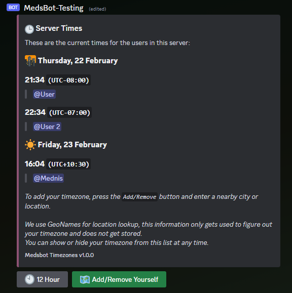

# Timezones
This cog lets your users set their timezones and allows you to view the time in their timezone, convert times between timezones,
see the difference between 2 timezones, and view the current time in a timezone.

The cog also has a persistent message that shows the current time in the set timezone of the users who have enabled it.
The timezone can also be setup using the buttons under the persistent message. 

The persistent message updates every 30 seconds.

The cog uses GeoNames for city/timezone lookup, and the API key can be set in the admin settings.

## Requirements
- Red 3.5+ is required for this cog to work.
- Geopy is required for this cog to work. 
  You can install it with `[p]pipinstall geopy` _(It should be installed automatically when you install the cog.)_

## Commands
### User Commands
- `/time`
	- `for <Person>` - Lets you see the current time of the selected person
	- `in <Location>` - Lets you see the current time in a specific location
	- `here` - Lets you show the current time where you are
- `/timezone`
	- `set` - Lets you set the timezone
		- `city <City/Location>` - lets you set your timezone based off the location of a nearby city. _(Uses GeoNames for lookup, your city's location is not stored!)_
		- `iana` - lets you set your timezone from an IANA timezone ([List here](https://en.wikipedia.org/wiki/List_of_tz_database_time_zones))
		- `remove` - Removes your set timezone
	- `difference <Person> <Person 2 (Optional)>` - Lets you see the timezone difference between you and someone else, or two people

All users can also right click on a user and select the `Apps` context menu to see the current time in the selected user's timezone.

### Admin Settings
- `/tz-setup`
  - `apikey <Api Key>` - Set the API key for the cog. (Used for GeoNames lookup)
  - `channel <Channel>` - Channel to send the persistent timezone message to.
  - `command_mention <Comamnd ID>` - The mention of the `/timezone set city` command. (Used in embeds, there is currently no simple way to get the mention of a command. Enter in the id of the command.)