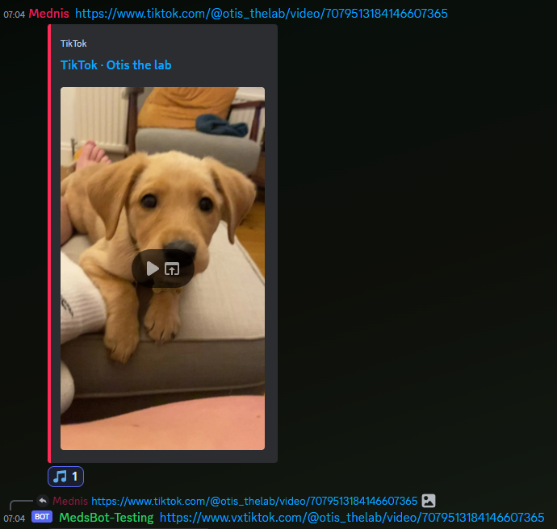

# VX-er
Offers the option to convert twitter and tiktok links into vxtiktok/vxtwitter links.
This means that you can watch the video(s) without leaving the app.

Every time a twitter or tiktok link is posted, the bot will react to it. 
Clicking the reaction will send a message with the link swapped out.

## Requirements
Red 3.5+ is required for this cog to work.

> [!IMPORTANT]  
> This cog only uses slash commands!

# Commands
- `vxer` - Base command group
  - `twitter <True/False> <Replacement domain>` - Enable or disable the twitter link replacement. 
  You can also set a custom domain for the replacement.
  - `tiktok <True/False> <Replacement domain>` - Enable or disable the tiktok link replacement. 
  You can also set a custom domain for the replacement.
